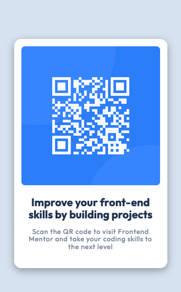

# Frontend Mentor - QR code component solution

This is a solution to the [QR code component challenge on Frontend Mentor](https://www.frontendmentor.io/challenges/qr-code-component-iux_sIO_H). Frontend Mentor challenges help you improve your coding skills by building realistic projects. 

## Table of contents

- [Frontend Mentor - QR code component solution](#frontend-mentor---qr-code-component-solution)
  - [Table of contents](#table-of-contents)
  - [Overview](#overview)
    - [Screenshot](#screenshot)
  - [My process](#my-process)
    - [Built with](#built-with)
    - [What I learned](#what-i-learned)

**Note: Delete this note and update the table of contents based on what sections you keep.**

## Overview

### Screenshot



## My process

### Built with

- Semantic HTML5 markup
- CSS custom properties
- CSS Grid
- Mobile-first workflow

**Note: These are just examples. Delete this note and replace the list above with your own choices**

### What I learned

The cool thing for me was to not use flexbox but try to solve all the things with `grid` instead. 

And to be fair `custom css properties` are awesome!


```css
.card {
    --card-padding-y: 1.5rem;
    --card-padding-x: 1rem;

    background-color: var(--clr-neutral-100);
    border-radius: 1rem;
    line-height: 1.1;
    margin: 2rem;
    max-width: 315px;
    overflow: hidden;
    padding: var(--card-padding-y) var(--card-padding-x);
    text-align: center;
  }
```